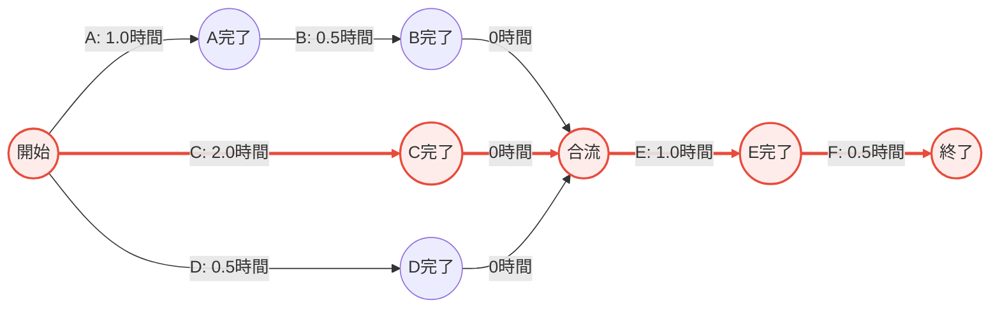

# 手巻き出前セット プロジェクト計画書

## プロジェクト概要

### 背景と目標

**いつまでに**: 2025年10月31日までに  
**何のために**: 2025年11月1日に出前寿司を提供するプロジェクトを開始したい  
**成果物**: 色々な場面を想定した手巻き出前セットを提供するための計画（調達、調理）  
**スコープ**: 計画書のみ（本ドキュメント）

---

## 選定食材セット

本プロジェクトでは、コストと人気度を最適化した以下の食材セットを採用します。

### 選定された食材（5品目）

1. **米（シャリ）** - 穀物【必須】
2. **いか** - 魚介類
3. **サーモン** - 魚介類
4. **きゅうり** - 野菜
5. **ねぎ** - 野菜

### コスト・品質サマリー

| 項目 | 値 |
|------|-----|
| **総調達コスト** | 4,130円 |
| **総販売個数** | 210個 |
| **総人気度** | 17点 / 25点満点（平均 3.4/5.0） |
| **総加工時間** | 3.5時間（原材料加工のみ） |

**詳細**: `2.Consider_plan_cost_risk/寿司食材セット_コスト分析結果.md` を参照

---

## 作業工程とスケジュール

### タスク一覧

| タスク名 | タスク内容 | 先行タスク | 所要時間 |
|---------|-----------|-----------|---------|
| **A** | 米炊き | なし | 1.0時間 |
| **B** | 料理酢混ぜ合わせ | Aが完了してから実行 | 0.5時間 |
| **C** | 魚を捌く | なし | 2.0時間 |
| **D** | 野菜、卵の加工 | なし | 0.5時間 |
| **E** | 材料合わせ、パック詰め | B、C、Dが終わってから実行 | 1.0時間 |
| **F** | 個包装調味料添付 | Eが終わってから実行 | 0.5時間 |

### PERT図（プロジェクトスケジュール）

以下のPERT図は、各タスクの依存関係と所要時間を視覚化したものです。
**赤色で強調されたパスがクリティカルパス**（最長経路）であり、プロジェクト全体の所要時間を決定します。

### クリティカルパス分析

**クリティカルパス**: C（魚を捌く）→ E（材料合わせ、パック詰め）→ F（個包装調味料添付）

**プロジェクト全体の最短完了時間**: **3.5時間**

#### パス別所要時間

1. **パス A→B→E→F**: 1.0 + 0.5 + 1.0 + 0.5 = **3.0時間**
2. **パス C→E→F**: 2.0 + 1.0 + 0.5 = **3.5時間** ← **クリティカルパス**
3. **パス D→E→F**: 0.5 + 1.0 + 0.5 = **2.0時間**

#### 並行作業の可能性

以下のタスクは並行実行が可能です：
- **A（米炊き）** と **C（魚を捌く）** と **D（野菜、卵の加工）**

これにより、実際の作業時間を短縮できます。

---

## リスクと対策

### 主要リスク

1. **クリティカルパス上の遅延リスク**
   - **タスクC（魚を捌く）**: 2.0時間と最も長い作業
   - **対策**: 経験豊富なスタッフを配置、事前準備を徹底

2. **調達リスク**
   - 食材の鮮度確保が必要
   - **対策**: 信頼できる仕入れ先の確保、前日調達の実施

3. **品質管理リスク**
   - 衛生管理の徹底が必要
   - **対策**: 作業工程ごとの品質チェックポイント設定

### バッファ時間

- タスクA、Dには余裕があるため（クリティカルパス外）、柔軟な調整が可能
- 全体として0.5時間程度のバッファを見込むことを推奨

---

## コスト内訳

### 材料費

| 食材 | カテゴリ | 単価（円/1ケース） |
|------|----------|-------------------|
| 米（シャリ） | 穀物 | 600 |
| いか | 魚介類 | 1,400 |
| サーモン | 魚介類 | 1,800 |
| きゅうり | 野菜 | 150 |
| ねぎ | 野菜 | 180 |
| **合計** | - | **4,130円** |

### その他想定コスト

- 調味料・副材料: 約500円
- パッケージ材料: 約300円
- **総見積コスト**: 約4,930円

---

## 実行計画

### 実施日: 2025年10月31日（木）

#### タイムライン（推奨）

| 時刻 | タスク | 担当者（推奨） |
|------|--------|---------------|
| 13:00 | 【開始】タスクA（米炊き）、C（魚を捌く）、D（野菜加工）を同時開始 | スタッフ3名 |
| 13:30 | タスクD完了 | - |
| 14:00 | タスクA完了 → タスクB（料理酢混ぜ合わせ）開始 | - |
| 14:30 | タスクB完了、タスクC完了 | - |
| 14:30 | タスクE（材料合わせ、パック詰め）開始 | - |
| 15:30 | タスクE完了 → タスクF（個包装調味料添付）開始 | - |
| 16:00 | タスクF完了 → 【プロジェクト完了】 | - |

**完了予定時刻**: 16:00（3時間で完了、余裕を見て16:30目標）

---

## 成果物

### 最終成果物

- **手巻き出前セット 210個**
  - まぐろ/サーモン等の寿司ネタ
  - シャリ（酢飯）
  - 薬味（きゅうり、ねぎ）
  - 個包装調味料（醤油、わさび等）

### 提供可能人数

- 1人あたり10個提供の場合: **約21名分**
- 1人あたり5個提供の場合: **約42名分**

---

## 承認・レビュー

| 項目 | 担当者 | 日付 | ステータス |
|------|--------|------|-----------|
| 計画立案 | プロジェクトマネージャー | 2025-10-29 | ✅ 完了 |
| コスト承認 | - | - | 🔲 未実施 |
| 最終承認 | - | - | 🔲 未実施 |

---

## 関連資料

- コスト分析詳細: `2.Consider_plan_cost_risk/寿司食材セット_コスト分析結果.md`
- タスク詳細: `2.Consider_plan_cost_risk/task.csv`
- 食材マスタ: `0.Reference/sushi_ingredients_extended.csv`
- 背景資料: `1.Background_goal/background.txt`

---

## 改訂履歴

| 版 | 日付 | 変更内容 | 作成者 |
|----|------|----------|--------|
| 1.0 | 2025-10-29 | 初版作成 | プロジェクトマネージャー |

---

**文書終了**

